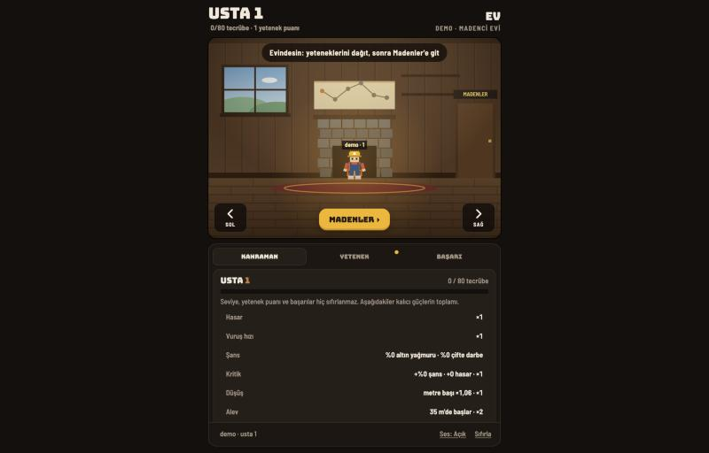
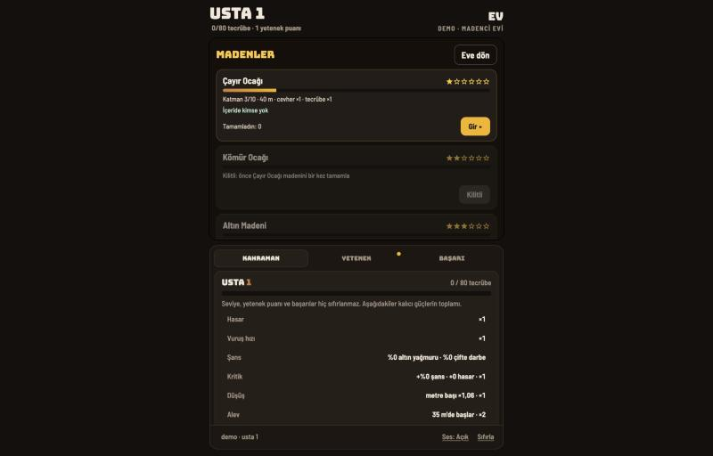
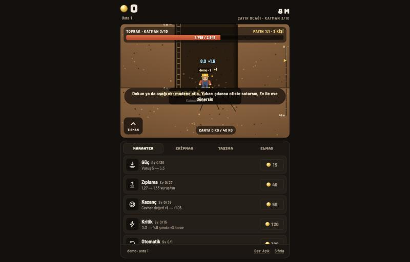

# Derin Kazı

Tarayıcıda oynanan madencilik oyunu. Kazdıkça derine inersin, çıkardığın cevheri
satıp yeteneklerini yükseltirsin, yeni madenlerin kilidini açarsın.

Aynı ağdaki herkes aynı dünyaya bağlanır: bir Mac'te sunucu açılır, telefon ve
tabletler `http://<mac-adı>.local:8765` adresinden aynı madene girer. Madenler
ortaktır — aynı katmanı kaç kişinin kazdığı ekranda görünür.

## Ekran Görüntüleri

<table>
<tr>
<td width="33%"><br><sub><b>Ev</b> — yetenek dağıtımı ve karakter</sub></td>
<td width="33%"><br><sub><b>Madenler</b> — kilitli/açık ocaklar</sub></td>
<td width="33%"><br><sub><b>Kazı</b> — katman canı, çanta ve yükseltmeler</sub></td>
</tr>
</table>

## Madenler

| Maden | Katman | İlk katman canı |
| --- | --- | --- |
| Çayır Ocağı | 10 | 1.500 |
| Kömür Ocağı | 12 | 30.000 |
| Altın Madeni | 14 | 600.000 |
| Safir Mağarası | 16 | 12.000.000 |
| Çekirdek Kuyusu | 18 | 240.000.000 |
| Derinlik Kapısı | 20 | 4.800.000.000 |

Her maden bir öncekinin bitirilmesiyle açılır. Katman canları `config.json`
içindeki `grow` katsayısıyla üstel büyür; dengeyi oradan ayarlayabilirsin.

## Çalıştırma

**Mac** — `Derin Kazı.app`'e çift tıkla. Sunucu arka planda açılır, oyun kendi
penceresinde başlar. Uygulama oyun klasörünün içinde durmalı.

**Windows** — `Baslat-Windows.bat`.

**Elle:**

```bash
python3 server.py
```

Sonra tarayıcıdan `http://localhost:8765` adresine git. Farklı port için
`PORT=8799 python3 server.py`.

Telefondan bağlanmak için Mac ile aynı Wi-Fi'da olman ve `http://<mac-adı>.local:8765`
adresini açman yeterli. Oyun PWA olarak kurulabilir (ana ekrana ekle).

## Dosyalar

| Dosya | İçerik |
| --- | --- |
| `game.js` | Oyun döngüsü, çizim, yetenek ve kazı mantığı |
| `server.py` | Dünya durumu, oyuncu kayıtları, ortak katman takibi |
| `config.json` | Maden tanımları, can eğrileri, cevher ve tecrübe oranları |
| `index.html` / `styles.css` | Arayüz |
| `sw.js` / `manifest.webmanifest` | PWA desteği |

## Veri

Oyuncu kayıtları ve dünya durumu `data/` klasöründe tutulur ve depoya dahil
edilmez. Sıfırdan başlamak için klasörü silmen yeterli.
